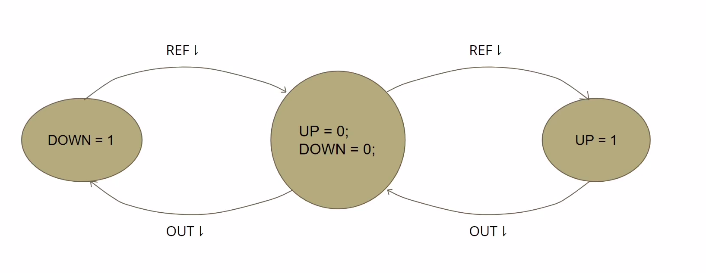

# Phase Locked Loop IC design using Google Skywater 130nm Workshop

## What is PLL?

PLL or Phase Locked Loop is a circuit arrangement used obtain precise clock signal without frequency or phase noise according to a given reference frequency of our choice. 

<br>
<br>

## Day 1 - PLL Theory and Lab Setup:


### **Topic #1:** Introduction to PLL

There are two kinds of oscillators that are used, they are:
1. Voltage Controlled Oscillators - They are oscillators whose frequency can be varied but can be affected by unwanted noises. 
2. Quartz Crystal Oscillators - They have pure spectrum, that is will not have nor get affected any unwanted noises.
   

- PLL intuition
  - PLL's as mentioned above are used to mimic a reference wave, that is to have the same or a multiple of the reference frequency with a constant phase difference.
- Components of a PLL
  
  
  <br>
  <br>

  - **Phase Frequency Detector(PFD):** Combines the output signal with the reference signal to receive the magnitude and sign of the phase difference between the current output and the reference signal
  - **Voltage Controlled Oscillator:** On-chip oscillator
  - **Charge Pump**: COnverts the digital output received from the PFD to analog
  - **Low Pass Filter:** Smoothens the current pulse in the output.

### **Note:** <br>```Such a multiplier is known as a "Clock Multiplier Phase Locked Loop" ```

<br>


### **Topic #2:** Introduction to Phase Frequency Detector

<br>

  - **Aim:** Give an output frequency showing the magnitude and sign of the phase difference between referance signal and output signal. 
  - **Method 1:**
    - Let's consider Doing an XOR operation between ouptut and reference signal
    

    - Here the problem is that we can't understand if the signal is leading or lacking without knowing which the output cannot be tuned accordingly.
  - **Method 2:**
    - In this case, consider two output signals, UP and DOWN
      - UP - if HIGH the output is lagging.
      - DOWN - if HIGH the output is leading.
    

    - Therefore for it's excitation diagram can be expressed as:
      - DOWN: From negative edge of OUT to negative edge of REF
      -  UP: From negative edge of REF to negative edge of OUT
      
   - Since the output of the circuit is edge triggered the circuit must be sequential in other words must be made up of flipflops.
   - The circuit diagram will be as follows:
   


### **Note:** <br>```When the gap between the triggers are really low the output at both UP and DOWN respectively won't be a complete one but rather a spike. This is known as a dead zone ```

### **Topic #3:** Introduction to Charge Pump

<br>
Converts the digital measure of phase/frequency difference into an analog control signal to control signal to control the oscillator.

  - This is achieved using a circuit called the current steering circuit.
  - It's purpose is to steer the current from VDD to output or from output to the ground according to the UP and DOWN signal we provide.
   
  <br>
  - When UP signal is active the current flows from VDD to output capacitor and charges it - increasing the charge at the output
  - If DOWN signal is active then the current flows from ground to the output capacitor hence the voltage at the output decreases thereby discharging the output capacitor
  - The output capacitor helps in smoothening the output signal
  - Therefore it's output characteristics will be

| Case                                                     | Output Graph                                          |
| -------------------------------------------------------- | ----------------------------------------------------- |
| Avg. UP signal active time >Avg. DOWN signal active time |      |
| Avg. DOWN signal active time >Avg. UP signal active time |  |

- Here the increase in voltage speeds up the oscillator while the reduction in current slows it down. 
- The MOSFET circuit for the same is:
  
  

- A small problem with the circuit is, even when both UP and DOWN signals are low, a small current in the form of leakage flows through the circuit. This continuously charges the circuit.

### Loop Filter

- Even after the smoothening of output signal by the output capacitor there is a chance for the output to output
- Without the loop filter the phase locked loop will not be able to lock and mimic the reference signal.
- THe details concerning the loop filter are as the follows:
  

### Voltage COntrolled Oscillator

- Consider delay as the time taken to charge the output. 
- So, if current is greater, the output gets charged faster.
- In this way, we can control over the oscillator frequency.
-  This can be achieved using a current starving mechanism around a ring oscillator

---
 ### **Note:** <br>```A ring oscillator is actually three CMOS inverters connected in series within a closed loop, as shown in the figure```


---

<br>

- On adding the current control circuit to have the frequency selector, we add the following extra elements into the CMOS inverter.[as shown in the below circuit]

- Here the highlighted part shows the current control circuits. 
- The input control voltage controls the current input to the ring oscillator there by tweaking the frequency of the output voltage. 

### Frequency Divider

- The basic principle behind frequency divider is that a  the output frequency of a toggle flipflop is half that of the input.
- A toggle flipflop can be constructed by connecting a inverted feedback loop in a D flipflop, as shown below.
 
<br>


<br>

### **Note:** <br>```Using one toggle flipflop we get to reduce the frequency to half the value, so on cascading n such flipflops we will be able to create a frequency division of value (1/2^n)``` 


## Terminologies related to PLL

 - **Lock Range:** The range of frequencies in which the PLL is able to maintain a lock given it's already in a lock condition.
   - *Here Lock means the range of frequencies at which the output is mimicking the i/p*
 - **Capture Range:** The range of frequencies in which the PLL is able to lock-in when starting, that is in an unlocked condition.
   - *This depends on the Loop filter bandwidth*
 - **Settling Time:** The time within which a PLL is able to attain a lock from a unlocked condition. 


## Tools required:
  - Ngspice: Transistor level circuit simulation
  - Magic: Layout Design and Parasitic Extraction
  
## Development flow:
- **SPICE-level Development:** It is the pre-layout phase in which circuit level development is done according to the specifications given.
- **Pre-layout Simulations(Theoretical Phase):**  The circuit is simulated and tested to see if it meets the requirements
- **Layout Development** Once the circuit is ready which meets the specifications then the layout is developed.[It is during the layout phase that we get to know about the parameters such as size, width and proximity of the design]
- **Parasitic Extraction:** After the Layout is Developed then the Capacitive Effect[that is the effect of length area, proximity etc.] is extracted from the circuit and this is known as parasitic extraction. This circuit is more near to the real world scenario.
- **Post-Layout Simulation:** This is done after layout and is even closer to tha actual world scenario than the pre-layout simulation. 


## Introduction to PDK, specifications and pre-layout circuits

- **PDK**: It means the Process Design Kit, this is provided by the fabrication center.

- **PDK Contents:**
  - io: input-output
  - pr: primitives (spice)
  - sc: standard cells
  - hd: high density
  - hs: high speed
  - lp: low power
  - hdll: high density low leakage

- **PLL Specifications**
  - The operating condition in which the PLL has tom operate.
  - It is based on these specifications that the circuit is designed.
    1. Corner: 'TT' - *TT- Typical-Typical: Represents the outcome of the doping process*
      - Other options are:
        - 'FF' - FF- Fast-Fast
        - 'SS' - SS- Slow-Slow
    2. Voltage Supply: 1.8V
    3. Room Temperature
    4. VCO and PLL mode
    5. Input F<sub>min</sub>: 5Mhz, F<sub>max</sub>: 12.5Mhz
    6. Jitter(RMS) <~ 20ns
    7. Duty Cycle <~ 50%
  ### **Note:** <br>```The first three specifications are known as the PVT corner because they are the minimum set of instructions to be met during fabrication for the IP to work dependably afterwards.```
  
